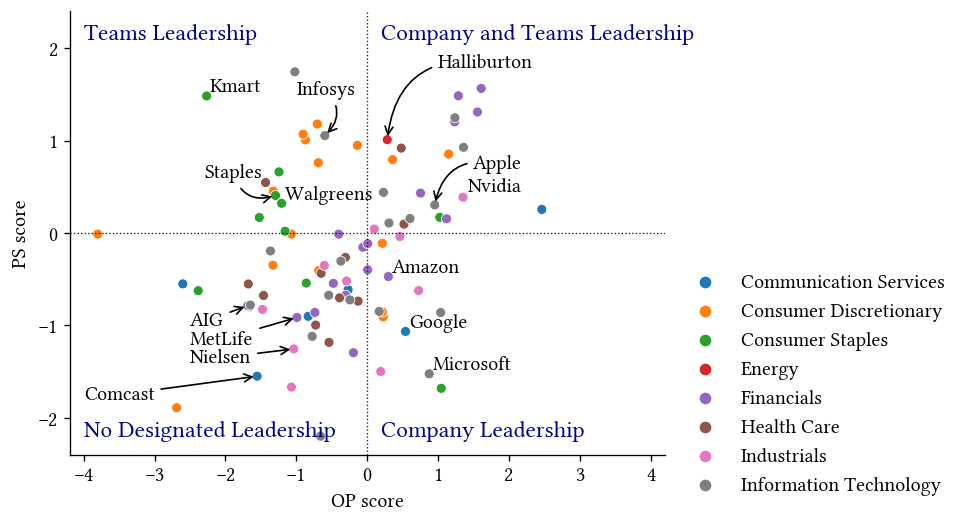

# Organizational Pride & Psychological Safety

Authors: Ali Septiandri, Sanja Šćepanović, Marios Constantinides, Licia Capra, Daniele Quercia

Analysis of organizational pride (OP) and psychological safety (PS) in US companies using Glassdoor data.

Our contributions:
1. We developed a state-of-the-art deep-learning Natural Language Processing (NLP) framework that accurately captures OP and PS at company-level.
2. We applied our framework to over 430,000 publicly available Glassdoor employee reviews, and validated it internally in terms of keywords expressed in high OP/PS companies, and externally in terms of associations of company OP/PS scores with the ratings. We also surfaced variations in OP/PS levels across different industry sectors from 318 of S&P 500 companies.
3. We explored the relationship between OP and PS, and identified four distinct types of companies: "Company and Teams Leadership," exhibited high levels of both OP and PS; "No Designated Leadership," characterized by low levels of both OP and PS; as well as two intriguing groups. We referred to companies with high OP but low PS as "Company Leadership," and those with high PS but low OP as "Teams Leadership.".

